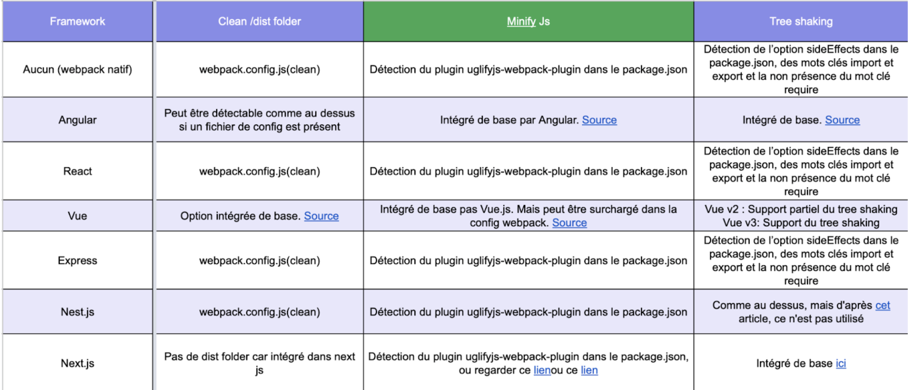
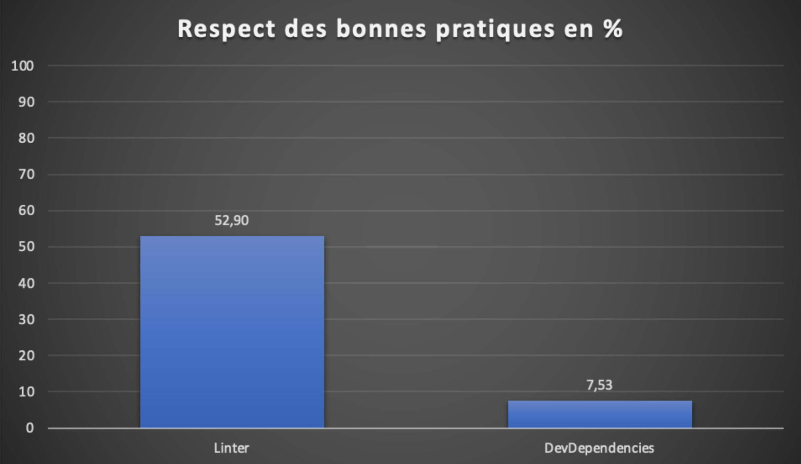
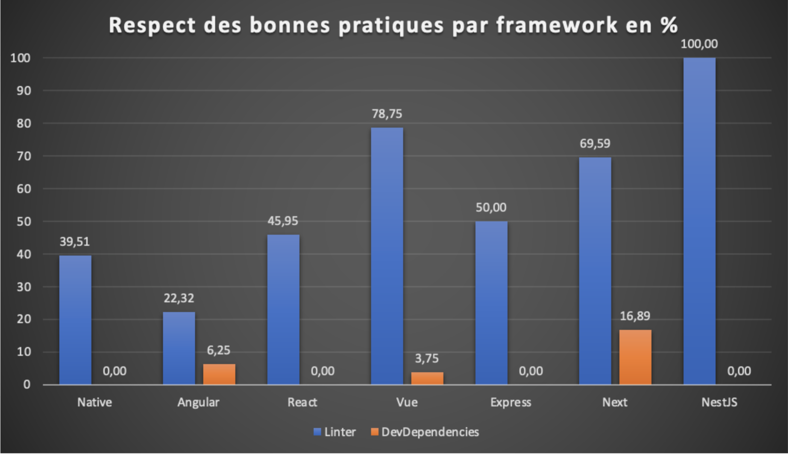
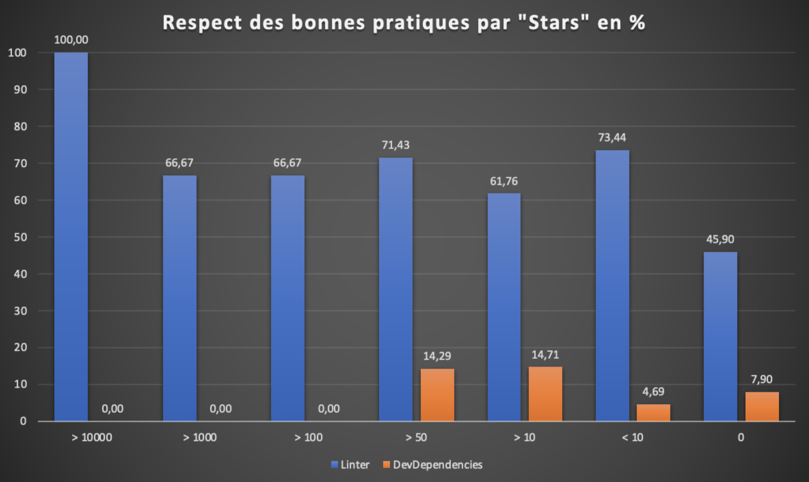
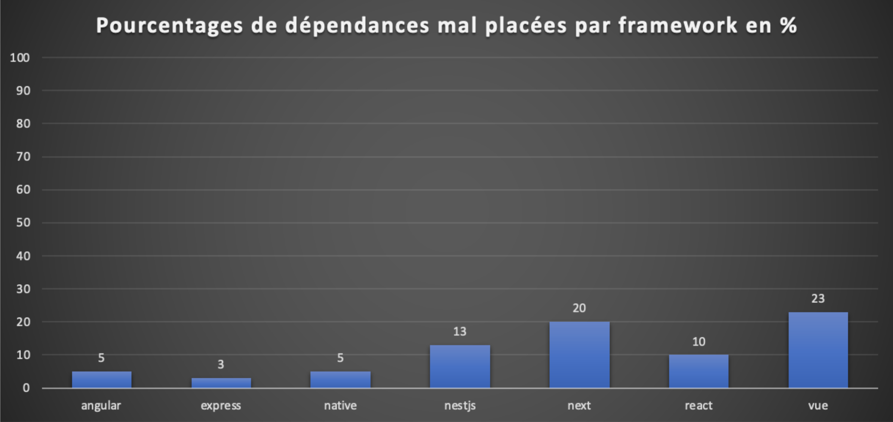
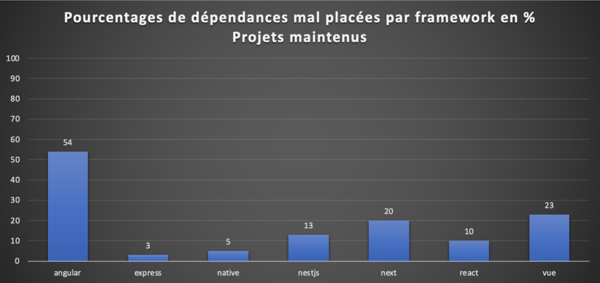

# 1. Contexte de recherche

L’écosystème Javascript est en perpétuel mouvement. Soutenue par une communauté open-source importante et grandissante, ce langage de programmation de scripts, initialement conçu pour des applications dans les navigateurs webs, ruisselle dans tous les domaines. On en retrouve aujourd’hui de plus en plus dans des applications de type serveurs et pour des usages de plus en plus variés.

Cet écosystème est aujourd’hui le plus large avec un nombre de dépendances disponible , au travers du gestionnaire de paquet NPM, supérieur à 1 million. Cette richesse emmène aussi avec elle de nombreuses problématiques.

En effet, l’augmentation du nombre de dépendances dans les projets Javascript entraîne un temps de compilation et de déploiement des projets de plus en plus important. De nombreux outils ont été créés pour packager ces projets tels que Webpack, Rollup, Gulp, Parcel, Snowpack, et aussi des systèmes pour gérer des projets multi-packages comme Lerna, ou d’autres qui embarquent un système précédent comme le cli-builder d’Angular embarquant webpack.

Ces outils viennent avec des explications de bonnes pratiques que les développeurs devraient respecter. En outre, certaines de ces bonnes pratiques proviennent plutôt de la communauté en elle-même. 

On remarque aussi une importance grandissante des framework de programmation Javascript que ce soit pour des applications front-end ou bien back-end. Ces frameworks peuvent obliger l’application de bonnes pratiques ou simplement les suggérer.

C’est dans ce contexte que notre étude va se tenir.

# 2. Observations / Question générale

Bien que l’utilisation de Javascript/Typescript soit en constante augmentation auprès des développeurs, il devient assez rare que ceux-ci ne choisissent pas d’utiliser au moins un packager d’applications.

En effet, la multiplication de l’utilisation de dépendance dans les projets à pour effet de rendre de plus en plus volumineux les applications qui sont générées. L’utilisation de ce type d’outil permet de réaliser un certain nombre de tâches fastidieuses et répétitives comme la gestion des dépendances, la compilation du code source, le déploiement d'applications sur des serveurs, de manière automatique.
Si on résume, ce genre d’outil sont des “compilateurs” de code Javascript / Typescript.

Parmi ceux-ci, l’un des plus connus et utilisés est Webpack. Il en existe d'autres tels que Gulp, Babel ou Parcel.

Tous ces outils définissent des bonnes pratiques à destination des développeurs qui permettent d’optimiser le code, améliorer la lecture, etc.

Nous avons voulu nous intéresser à ces bonnes pratiques et notamment celles encouragés par Webpack dans la communauté Open source en répondant à la question suivante :

**Les bonnes pratiques définies et encouragées par Webpack sont-elles respectées par la communauté Open Source ?**

De cette question assez large, nous nous sommes alors demandé comment nous pouvions y répondre de façon satisfaisante. De ces réflexions sont ressortis plusieurs sous-questions qui nous ont permis de décomposer l’interrogation initiale.

### Peut-on trouver une corrélation entre l'utilisation de bonnes pratiques et des caractéristiques des projets ?

Par caractéristiques des projets, nous entendons, par exemple :
- Taille du projet (nombre de ligne de code)
- Ancienneté
- Nombre de contributeurs
- Nombre d’étoiles sur Github
- …

Intuitivement, nous pensons que l’on devrait pouvoir mettre en relation ces données avec l’utilisation des bonnes pratiques au sein de ces projets. Avant toute analyse, nous pensons que plus un projet à de contributeurs plus les bonnes pratiques de développement sont respectés car cela devrait aider à ce qu’il soit plus facilement maintenable et avoir une cohérence dans sa base de code. De plus, un projet qui aurait beaucoup d'étoiles devrait être de la même manière plus enclin à respecter ce genre de bonnes pratiques qu’un autre. C’est ce que nous allons essayer de vérifier au cours de cette étude.

### L’utilisation de framework Javascript a-t-il un impact sur l’utilisation de ces bonnes pratiques ?

En 2022, il est de plus en plus rare de trouver des projets, qu’il soit backend ou frontend, qui ne font pas usage d’un framework de programmation. Ces frameworks donnent aux développeurs de nombreuses fonctionnalités et facilité de de développement qui permettent d'accélérer le développement d’une application. L’utilisation de Javascript “vanilla” est aujourd’hui cantonnée aux petits projets. 
Ces frameworks viennent avec des configurations par défaut et obligent pour certains à l’utilisation de certaines bonnes pratiques.

Nous avons donc voulu savoir si l’utilisation des frameworks pouvait être corrélé à une meilleure et plus grande utilisation de bonnes pratiques de développement.

# 3. Collecte d’informations

Avant de commencer à tenter de répondre aux questions que nous nous posions, nous avons déterminé une marche à suivre qui nous permettrait de le faire. 

## Les bonnes pratiques	

Nous avons tout d’abord réalisé une étude des bonnes pratiques recommandées dans le monde Javascript et par Webpack. Après quelques recherches, nous sommes vite arrivés à la conclusion que celles-ci étaient trop nombreuses pour en faire un listing complet. De plus, certaines nous paraissaient moins intéressantes que d'autres soit à cause de leur cas d’usage soit parce qu’elles adressaient des problématiques peu communes.
Nous avons donc extrait une liste des “candidats bonnes pratiques” à analyser dans la suite.

- Utilisation d’un Linter
- Clean /dist folder
- Minify JS/HTML/CSS
- Tree Shaking
- Devpackage dans les DevDependencies
- Webpack config file
- Build Command dans le package.json
- Webpack in production / developpement mode
- Devtools in production
- Avoid inline/eval in production

Toutes ces bonnes pratiques sont recommandées par Webpack et par la communauté que ce soit pour la lisibilité du code, ses performances, sa taille une fois compilé ou bien une combinaison de ces trois.

## Les frameworks

Nous avons en parallèle des bonnes pratiques, défini quels seraient les frameworks que nous étudierons en plus des projets dits pure Webpack. Ce choix s’est fait sur la popularité de ceux-ci. De plus, nous voulions une certaine équité entre les frameworks backend et frontend. Nous avons utilisé le site [StateOfJs](https://stateofjs.com) pour sélectionner ces frameworks qui sont donc :
- Angular (frontend)
- Vue (frontend)
- React (frontend)
- NestJs (backend)
- NextJs (frontend)
- Express (backend)

## Les marqueurs
Nous avons ensuite déterminé pour chacune des bonnes pratiques et des frameworks qu’elle était la manière de détecter leur utilisation. Il s’agit donc ici de trouver des marqueurs de cette utilisation que nous pourrions par la suite utiliser et automatiser pour extraire les données dont nous avions besoin.
Nous avons eu quelques difficultés à réaliser ce travail sur les différents frameworks choisis. En effet, la majorité de ceux-ci cachent leur utilisation et définissent des configurations par défaut. Les techniques normales de détection ne fonctionnent donc pas toutes avec ceux-ci et nous avons donc du lister la façon de faire pour chacun d’entre eux.
Ci-dessous, un exemple de ce travail.

## Échantillonnage des projets :

Nous avons sélectionné quelques projets pour tester à la main si notre façon de détecter les bonnes pratiques était correcte. Nous avons choisi un ou deux projets parmi les plus téléchargés sur Github et quelques autres plus petits au hasard.
Nous avons ainsi pu valider que les marqueurs que nous avions sélectionnés permettaient bien de détecter les bonnes pratiques.

# 4. Hypothèse et expériences

Des 10 bonnes pratiques que nous avons jugé intéressantes, nous nous sommes focalisés sur 2 de celles-ci, à savoir :
- Utilisation d’un Linter
- DevPackage dans les DevDependencies

Les hypothèses que nous avons formulé sont les suivantes :

- Le taux d’utilisation des bonnes pratiques doit être corrélé positivement avec le nombre de contributeurs au projet, son nombre d’étoiles sur Github ainsi que par son ancienneté.
- Plus un projet est petit, moins les bonnes pratiques sont respectées.
- L’utilisation d’un framework devrait avoir un effet positif sur ce taux d’utilisation en forçant par défaut l'utilisation de celle-ci.

Pour pouvoir déterminer si nos hypothèses étaient justes, nous avons mis en place un outillage dont le but était de :
- Trier et télécharger des projets open source disponible sur Github
- Filtrer les projets pour ne garder que ceux qui rentrait dans nos critères (framework et webpack)
- Analyser ceux-ci pour détecter les marqueurs de l’utilisation des bonnes pratiques
- Enregistrer les résultats dans une base de données SQL
- Extraire et analyser les résultats

Nous avons lancé l’analyse sur un ensemble de données dont voici les caractéristiques :

On peut remarquer certains biais dans l’ensemble de données utilisé. Tout d’abord, certains frameworks sont peu voir très peu représentés ce qui est le cas de Express et NestJs. Les résultats que l’on va obtenir sur ces frameworks sont donc peu fiables. Naturellement, les projets ayant 0 étoile sont les plus nombreux ce qui semble normal compte tenu de la façon dont nous avons sélectionné les projets (par date de mise à jour). Pour finir, les projets ayant moins de 10 contributeurs sont les plus nombreux. Ce qui peut rendre les résultats pour les projets ayant le plus de contributeurs peu fiables aussi.
Nous avons étudié l’utilisation d’un Linter et le respect des DevPackage dans les Devdepencies. Les résultats sont binaires, soit il respecte soit non. Pour les DevPackage, cela veut dire qu’il suffit qu’un seul package soit mal placé pour catégoriser le projet comme ne respectant pas cette bonne pratique.

Néanmoins, voici les premiers résultats obtenus :

Ces résultats sont surprenants. Nous nous attendions à des pourcentages plus élevés que ceux constatés. On remarque aussi que la bonne pratique des dev dependency n’est presque pas respectée selon nos critères de vérification.

On remarque qu'en moyenne les frameworks backend respectent mieux ces deux bonnes pratiques que les framework frontend. L’utilisation d’un framework tend à pousser au respect des bonnes pratiques. Néanmoins certains chiffres sont à relativiser au vu du faible nombre de projets dans le set de données (NestJs).

L’utilisation d’un Linter tend à augmenter avec le nombre de contributeurs ce qui était attendu. Mais bizarrement, les plus gros projets ne semblent pas respecter la seconde bonne pratique étudiée ici à savoir les dev dependency.

L’utilisation d’un Linter tend à augmenter avec le nombre d’étoiles. Mais encore une fois, les projets les plus aimés ne semblent pas respecter la seconde bonne pratique.

Avec ces résultats intermédiaires, nous avons identifié plusieurs limites à cette première analyse.
Premièrement, il semble que notre ensemble de données ne soit pas suffisamment grand pour tirer des conclusions sur certains frameworks.
Deuxièmement, nous ne sommes pas assez fin sur l’identification du respect des dev dependecy. Dans cette étude, un projet qui compte une dépendance mal placée se trouve catégorisé comme ne respectant pas. Il serait plus intéressant d’avoir le pourcentage de dépendance mal placé.
Nous nous sommes alors penché sur ces faiblesses pour la seconde partie de l’étude.

# 5. Analyse des résultats et conclusion

Dans la suite de cette étude, nous allons vous présenter les résultats affinés. Nous avons décidé de creuser nos premières conclusions qui semblaient étranges. Pour ce faire, nous avons revu la façon dont on identifiait un projet qui ne respecte pas les dev dependency.
A la place d’avoir un résultat binaire, nous avons choisi d’ajouter de la nuance pour se rendre compte du taux de dépendance mal placé dans un projet. Cela nous paraît être un meilleur indicateur car notre façon de catégoriser une dépendance comme étant une dépendance de développement peut être remise en question. 

| Catégorie         | Dépendance mal placé en % | Nb Projets |
| :---------------: |:-------------------------:|:----------:|
| vue               | 23                        | 196        |
| next              | 20                        | 20         |
| nestjs            | 13                        | 6          |
| react             | 10                        | 743        |
| angular           | 5                         | 61         |
| native            | 5                         | 797        |
| express           | 3                         | 89         |

De ces résultats, on peut tirer quelques conclusions. Tout d’abord, la différence entre framework backend et frontend ne semble pas évidente. L’utilisation d’un framework à la place de webpack native ne semble pas être un facteur déterminant pour le respect de cette bonne pratique. Les chiffres tendent même à montrer le contraire.
Une explication à ces résultats pourrait venir du fait qu’un projet qui n’utilise pas de framework est surement de plus petite envergure et son nombre de dépendance doit être moins important ce qui implique moins de chance d’en avoir des mal placés.
Ces résultats nous paraissent aller à l’encontre de ce que nous attendions. Nous avons voulu savoir si lorsqu’on réduisait l’ensemble de données à des projets étant encore maintenue nous avions les mêmes résultats.

| Catégorie         | Dépendance mal placé en % | Nb Projets |
| :---------------: |:-------------------------:|:----------:|
| angular           | 54                        | 29         |
| vue               | 23                        | 106        |
| next              | 20                        | 17         |
| nestjs            | 13                        | 6          |
| react             | 10                        | 430        |
| native            | 5                         | 590        |
| express           | 3                         | 62         |

Nous avons défini un projet maintenu comme ayant eu au moins un commit dans la dernière année. 
Les résultats sont globalement identiques avec seulement les projets maintenus. Mise à part, l’anomalie Angular, les résultats sont confirmés.

## Conclusion

La question à laquelle nous tentions de répondre était la suivante : 

**Les bonnes pratiques définies et encouragées par Webpack sont-elles respectées par la communauté Open Source ?**

En ce qui concerne, les deux bonnes pratiques étudiées ici la réponse est assez mitigée. L’utilisation du Linter semble être bien corrélé avec la taille du projet ainsi qu’avec son nombre de contributeurs. Néanmoins, au total,  seulement 50% des projets étudiés respectent cette bonne pratique. La conclusion que l’on peut tirer est que la communauté Open Source dans son ensemble considère que le Linter devient utile lorsque le nombre de contributeurs augmente ainsi que la taille du projet.

Pour ce qui est des dev dependency, il est difficile de conclure dans un sens ou dans l’autre. Globalement, on ne dépasse pas 25% de dépendance mal placée, ce que l’on peut considérer comme beaucoup selon les dépendances en question. La façon dont on a défini ce qu’est une dépendance de développement est aussi sujette à caution. Sur l’ensemble de données étudié, nous extrayons les dépendances de développement et passé un certain seuil d’utilisation, elle rentre dans les les dépendances que l’on surveille. Il existe ici un biais. On utilise les données des projets étudiés pour classifier ces mêmes projets. Il serait intéressant de constituer un ensemble de dépendance de développement indépendamment des projets étudiés.

# 6. Outils

Dans l’objectif d’extraire des informations de façon automatisée sur les différents projets open-source de GitHub, nous avons développé différents scripts en Typescript.
Nous n’avons pas utilisé d’outils autre que des librairies npm pour nous aider à utiliser l’API de GitHub, ou pour stocker nos données dans une base de données SQLite.
Nous avons développé 4 outils différents.
Le premier `download` nous permet de télécharger depuis l’API Github un maximum de 1000 projets en fonction de plusieurs critères. Nous filtrons les projets en fonction des mots clés présents dans le package.json. Puis nous classons les projets en fonction de 3 critères, le nombre d’étoiles, le nombre de contributeurs ou la dernière date d'actualisation du projet.
Après avoir récupéré une liste de projet, on télécharge de façon simultané tous les projets listés et on conserve les caractéristiques du projet dans un fichier `details.json` et en base de données.

Le deuxième outil `categorize` permet de catégoriser les différents projets en fonction des dépendances de celui-ci, un projet avec la dépendance angular-ci sera considéré comme utilisant le framework Angular par exemple.
Le troisième outil `scan` est utilisé pour mettre à jour son set de données en local. Il permet en fonction des outils, de supprimer les projets en local qui ne sont pas dans la base de donnée ou au contraire de les ajouter à la base de donnée. Il permet également de supprimer le contenu des projets qui ne parviennent pas à être identifiés pour gagner de l’espace de stockage.

Pour finir les derniers outils / commandes `analyze` sont utilisés pour récupérer les différents metrics sur les projets en rapport avec les bonnes pratiques. Par exemple, le nombre de règles ESLint utilisé dans un projet ou le nombre de ‘dev-dependencies’ à la mauvaise place dans un projet en rapport avec le nombre de total de dépendances du projet.
Tous les scripts possèdent l’option `--help` pour afficher la liste des options / arguments possibles pour chaque outil. 

# Références

« **Angular** ». Consulté le 28 février 2022. https://angular.io/.

« **NestJS - A progressive Node.js framework** ». Consulté le 28 février 2022. https://nestjs.com/.

« **Next.js by Vercel - The React Framework** ». Consulté le 28 février 2022. https://nextjs.org/.

« **React – A JavaScript library for building user interfaces** ». Consulté le 28 février 2022. https://reactjs.org/.

« **The State of JavaScript Survey** ». Consulté le 28 février 2022. https://stateofjs.com/.

« **Vue.js - The Progressive JavaScript Framework | Vue.js** ». Consulté le 28 février 2022. https://vuejs.org/.

« **Webpack** ». Consulté le 28 février 2022. https://webpack.js.org/.

« **10 Best JavaScript Minifiers Libraries in 2022 | Openbase** ». Consulté le 28 février 2022. https://openbase.com/categories/js/best-javascript-minifiers-libraries.
